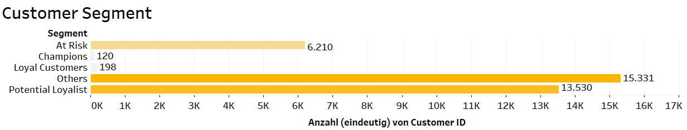
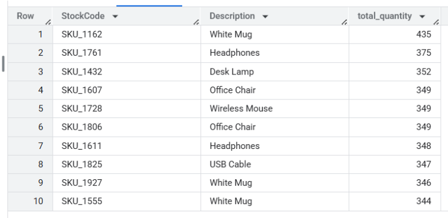
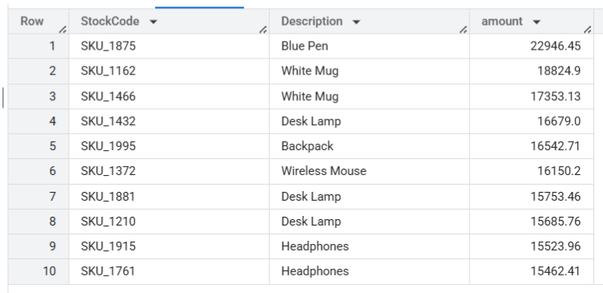
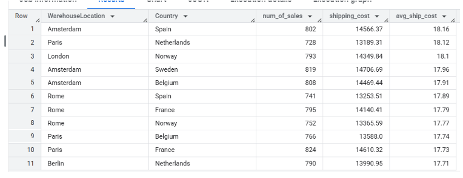

# Online-Retail-Analysis

## Overview
This project analyzes an e-commerce retail dataset to identify key sales trends and customer behavior patterns. Using SQL and Tableau, I performed data cleaning, KPI analysis, and RFM-based customer segmentation to support marketing strategy and improve customer retention.

## Project Goals
The main objectives of this project are: 
 - Understand customer purchasing behavior and identify valuable customer segments

 - Provide actionable insights for the marketing and sales teams to improve customer retention

 - Analyze overall sales performance and detect unusual patterns or data quality issues

 - Build a dynamic dashboard to visualize key metrics and support data-driven decision-making

 - Demonstrate strong data analytics skills, including SQL querying, data cleaning, segmentation techniques, and dashboard design

## Dataset
This analysis is based on dataset from Kaggle: 
https://www.kaggle.com/datasets/yusufdelikkaya/online-sales-dataset

## Repository Structure
images/ - A directory containing image files. 

bad_records.csv - A CSV file containing records flagged as invalid or erroneous during data processing.

online_sales_cleaned.csv - A cleaned version of the online sales dataset, ready for analysis after preprocessing.

online_sales_dataset.csv - The raw dataset of online sales, including all transactional data before cleaning.

rfm_scores.csv - A CSV file with RFM (Recency, Frequency, Monetary) scores calculated for customer segmentation. 

## Tools Used
- **SQL**: Data cleaning and initial analysis, data manipulation (BigQuery).
- **Tableau**: Interactive dashboards and data visualization.
- **GitHub**: Project hosting.

## Analysis step-by-step
### Data Cleaning
The initial dataset contained 49,782 rows.

1. Data Types Inspection
I began by inspecting the data types of each column to ensure consistency for further analysis. All data types were appropriate, so no changes were required.

2. Invoice Number Analysis
I checked for missing and duplicate values in the InvoiceNo column:

Missing values: None

SELECT InvoiceNo
FROM `Online_Retail.online_sales_dataset`
WHERE InvoiceNo IS NULL

Duplicates: 1,260 duplicate invoice numbers

SELECT InvoiceNo, COUNT(*) AS cnt
FROM `Online_Retail.online_sales_dataset`
GROUP BY InvoiceNo
HAVING COUNT(*) > 1

Further investigation showed that these duplicated invoice numbers do not represent exact duplicates. The corresponding rows differ in product details, timestamps, and other relevant fields:

SELECT *
FROM `Online_Retail.online_sales_dataset`
WHERE InvoiceNo IN (
  SELECT InvoiceNo
  FROM `Online_Retail.online_sales_dataset`
  GROUP BY InvoiceNo
  HAVING COUNT(*) > 1
)

Decision: Keep the duplicates because:

They contain distinct and valuable transaction details (product, price, time, etc.).

They represent only 5% of the dataset (2,548 rows), which will not significantly affect the analysis.

3. Missing Values and Negative Quantities
I identified missing values in the following columns:

CustomerID: 4,978 missing

ShippingCost: 2,489 missing

WarehouseLocation: 3,485 missing

I then explored rows where all three of these fields were missing simultaneously, and found 2,489 such rows. Additionally, all of these rows had negative values in Quantity, which is logically invalid.

SELECT *
FROM `Online_Retail.online_sales_dataset`
WHERE ShippingCost IS NULL
  AND CustomerID IS NULL
  AND WarehouseLocation IS NULL
  AND Quantity < 1

These rows are considered invalid and unreliable for analysis.

Before deletion, I saved these records into a backup table:

CREATE TABLE `Online_Retail.bad_records` AS
SELECT *
FROM `Online_Retail.online_sales_dataset`
WHERE CustomerID IS NULL
  AND ShippingCost IS NULL
  AND WarehouseLocation IS NULL
  AND Quantity < 0;
  
Then removed them from the main dataset:

DELETE FROM `Online_Retail.online_sales_dataset`
WHERE CustomerID IS NULL
  AND ShippingCost IS NULL
  AND WarehouseLocation IS NULL
  AND Quantity < 0;

4. Final Dataset
After cleaning, the dataset now contains 47,293 rows. I saved this cleaned version under the name 'sales' for simplicity.

Remaining missing values:

CustomerID: 2,489 (5.2%)

WarehouseLocation: 996 (2%)

These nulls were retained, as they are not critical for further analysis.

5. Outlier Detection

InvoiceDate
Date range is from 1 January  2020 to 5 September 2025 — no anomalies found. 

SELECT MIN(InvoiceDate), MAX(InvoiceDate)
FROM `Online_Retail.sales`

UnitPrice
Price values were analyzed for min, max, mean, and median:

SELECT MIN(UnitPrice), MAX(UnitPrice), AVG(UnitPrice),
       APPROX_QUANTILES(UnitPrice, 2)[OFFSET(1)] AS median_price
FROM `Online_Retail.sales`

Results were consistent - no extreme outliers.

Discount and ShippingCost
Both columns were also within a reasonable range, no data cleaning required.

6. String Consistency
To ensure categorical values were standardized, I checked for inconsistencies in string columns, particularly the Country column:

SELECT DISTINCT Country
FROM `Online_Retail.sales`

No anomalies such as inconsistent naming (e.g., "United Kingdom" vs. "U.K.") were found.

Conclusion: The dataset is now clean, reliable, and ready for analysis.

### Data Analysis
#### A. Revenue Overview
Total Revenue:

SELECT ROUND(SUM(Quantity * UnitPrice * (1 - Discount)), 2) AS total_revenue
FROM `Online_Retail.sales`

Revenue by Country:

SELECT Country, ROUND(SUM(Quantity * UnitPrice * (1 - Discount)), 2) AS revenue_by_country
FROM `Online_Retail.sales`
GROUP BY Country
ORDER BY revenue_by_country DESC

Revenue appears to be relatively equal across countries.

Revenue by Product Category:

SELECT Category, ROUND(SUM(Quantity * UnitPrice * (1 - Discount)), 2) AS revenue_by_category
FROM `Online_Retail.sales`
GROUP BY Category
ORDER BY revenue_by_category DESC

Similarly, each product category generates approximately equal revenue.

Revenue by Sales Channel:

SELECT SalesChannel, ROUND(SUM(Quantity * UnitPrice * (1 - Discount)), 2) AS revenue_by_channel
FROM `Online_Retail.sales`
GROUP BY SalesChannel
ORDER BY revenue_by_channel DESC

 Both online and offline sales channels generate similar revenue.

#### B. Customer Analysis
Number of Unique Customers: 35,389

SELECT COUNT(DISTINCT CustomerID) AS count_customers
FROM `Online_Retail.sales`

Average Order Value per Customer:

SELECT DISTINCT CustomerID AS customer,
  ROUND(SUM(Quantity * UnitPrice * (1 - Discount)) / COUNT(DISTINCT InvoiceNo), 2) AS average_check
FROM `Online_Retail.sales`
WHERE CustomerID IS NOT NULL
GROUP BY CustomerID
ORDER BY average_check DESC

No single customer dominates revenue — no strong outliers found.

Overall Average Order Value: $966.78

SELECT ROUND(SUM(Quantity * UnitPrice * (1 - Discount)) / COUNT(DISTINCT InvoiceNo), 2) AS total_average_check
FROM `Online_Retail.sales`
WHERE CustomerID IS NOT NULL

#### C. RFM Analysis
To segment customers by value and behavior, I conducted an RFM analysis, based on:

Recency – days since last purchase

Frequency – number of distinct purchases

Monetary – total spend

This allows to:

 - Identify high-value customers

 - Target loyal or at-risk segments

 - Personalize marketing strategies

Step 1: Calculate R, F, and M metrics

SELECT
  CustomerID,
  DATE_DIFF(DATE('2025-09-05'), DATE(MAX(InvoiceDate)), DAY) AS Recency,
  COUNT(DISTINCT InvoiceNo) AS Frequency,
  ROUND(SUM(Quantity * UnitPrice * (1 - Discount)), 2) AS Monetary
FROM `Online_Retail.sales`
GROUP BY CustomerID

Step 2: Calculate quartiles for Recency (to assign scores)

SELECT 
  MIN(Recency) AS min_r, MAX(Recency) AS max_r,
  AVG(Recency) AS avg_r, 
  APPROX_QUANTILES(Recency, 4)[OFFSET(1)] AS q1_25,
  APPROX_QUANTILES(Recency, 4)[OFFSET(2)] AS median,
  APPROX_QUANTILES(Recency, 4)[OFFSET(3)] AS q3_75
FROM `Online_Retail.rfm_scores`

Step 3: Assign RFM scores and segment customers

CREATE OR REPLACE TABLE `Online_Retail.rfm_scores` AS
SELECT
  CustomerID,
  Recency,
  Frequency,
  Monetary,

  -- R Score
  CASE
    WHEN Recency <= 429 THEN 5
    WHEN Recency <= 906 THEN 4
    WHEN Recency <= 1454 THEN 3
    WHEN Recency <= 2074 THEN 2
    ELSE 1
  END AS R_score,

  -- F Score
  CASE
    WHEN Frequency >= 5 THEN 5
    WHEN Frequency = 4 THEN 4
    WHEN Frequency = 3 THEN 3
    WHEN Frequency = 2 THEN 2
    ELSE 1
  END AS F_score,

  -- M Score
  CASE
    WHEN Monetary >= 1770 THEN 5
    WHEN Monetary >= 890 THEN 4
    WHEN Monetary >= 346 THEN 3
    WHEN Monetary >= 0.72 THEN 2
    ELSE 1
  END AS M_score,

  -- Final Segment
  CASE
    WHEN R_score >= 4 AND F_score >= 4 AND M_score >= 4 THEN 'Champions'
    WHEN R_score >= 4 AND (F_score >= 3 OR M_score >= 3) THEN 'Potential Loyalist'
    WHEN R_score >= 3 AND F_score >= 3 AND M_score >= 3 THEN 'Loyal Customers'
    WHEN R_score = 2 AND (F_score >= 3 OR M_score >= 3) THEN 'At Risk'
    WHEN R_score = 1 THEN 'Lost'
    ELSE 'Others'
  END AS Segment
FROM `Online_Retail.rfm_scores`

This segmentation allows targeted strategies for each group (e.g., retain Champions, re-engage Lost customers).

Next step: Count customers per segment and visualize.

D. Product Performance
Top 10 Products by Sales Volume:

SELECT StockCode, Description, SUM(Quantity) AS total_quantity
FROM `Online_Retail.sales`
WHERE Quantity > 0
GROUP BY StockCode, Description
ORDER BY total_quantity DESC
LIMIT 10

Top 10 Products by Revenue:

SELECT StockCode, Description, ROUND(SUM(Quantity * UnitPrice * (1 - Discount)), 2) AS amount
FROM `Online_Retail.sales`
WHERE Quantity > 0
GROUP BY StockCode, Description
ORDER BY amount DESC
LIMIT 10

Most Returned Products:

SELECT StockCode, Description, COUNT(ReturnStatus) AS returned
FROM `Online_Retail.sales`
WHERE ReturnStatus = 'Returned'
GROUP BY StockCode, Description
ORDER BY returned DESC
LIMIT 20

E. Channels & Shipping

Revenue by Sales Channel:

SELECT SalesChannel, ROUND(SUM(Quantity * UnitPrice * (1 - Discount)), 2) AS revenue
FROM `Online_Retail.sales`
GROUP BY SalesChannel

Shipping Cost vs Revenue by Provider:

SELECT ShipmentProvider,
       ROUND(SUM(Quantity * UnitPrice * (1 - Discount)), 2) AS total_revenue,
       ROUND(SUM(ShippingCost), 2) AS total_shipping_cost
FROM `Online_Retail.sales`
GROUP BY ShipmentProvider
ORDER BY total_shipping_cost DESC

Average Shipping Cost by Warehouse and Country:

SELECT DISTINCT WarehouseLocation, Country,
       COUNT(InvoiceNo) AS num_of_sales,
       ROUND(SUM(ShippingCost), 2) AS shipping_cost,
       ROUND(SUM(ShippingCost)/COUNT(InvoiceNo), 2) AS avg_ship_cost
FROM `Online_Retail.sales`
WHERE WarehouseLocation IS NOT NULL
GROUP BY WarehouseLocation, Country
ORDER BY avg_ship_cost DESC

F. Time Series & Product Category Trends
Revenue and Number of Orders per Day by Product Category:

SELECT Category, DATE(InvoiceDate) AS InvoiceDate,
       ROUND(SUM(Quantity * UnitPrice * (1 - Discount)), 2) AS revenue,
       COUNT(InvoiceNo) AS num_of_invoice
FROM `Online_Retail.sales`
GROUP BY Category, InvoiceDate
ORDER BY revenue DES

After conducting this analysis, I noticed that the data is relatively evenly distributed across various dimensions — including revenue, countries, shipment providers, payment methods, and other categories.
While this could be plausible, it is more likely due to the fact that the dataset is synthetic (artificially generated).

#### Observations
One notable inconsistency in the data:
Despite having both Online and In-store sales channels, cash payment methods are missing. If this were a real dataset, I would request inclusion of cash transactions for more accurate channel-specific analysis.

### Visualization
I created visualizations of the following metrics: 

Revenue over time

Average check

Return rate (%)

Sales by country

Sales by product category

Shipping cost, 

as well as an interactive dashboard with dynamic filters:

Sales channel

Payment method

Country

Product category

Shipment provider

🔗 [Explore the Dashboard](https://public.tableau.com/app/profile/olesia.zahudaieva/viz/Dashboard_17486010555690/Dashboard1)

## Conclusions and Business Recommendations

Based on the analysis, the business exhibits stable revenue but shows signs of declining profitability due to inflation. Several data issues were detected, especially regarding payment methods. The following recommendations aim to address these gaps and strengthen customer relationships.

### Stable Revenue, Decreasing Profitability
Over the 5-year period covered in the dataset, revenue remained stable. However, given that inflation, wages, and other operational costs have increased over this time, stable revenue likely means declining profitability.

### Missing or Incomplete Payment Data
The dataset includes both online and in-store transactions, but all recorded payment methods are electronic (Bank Transfer, Credit Card, PayPal).
It is widely known that many customers still use cash for in-store purchases—especially for low-value items like mugs or pens.

If the lack of cash data is due to incomplete reporting, it is recommended to gather the missing data and repeat the analysis.

If cash payments are not supported in physical stores, this is a missed opportunity, and the business should consider implementing cash payment options to increase accessibility and capture all types of buyers.

### Customer Segment Recommendations
Based on RFM segmentation, the following actions are recommended for each customer group:

Champions
Most active customers: purchased recently, frequently, and spent a lot.
→ Offer exclusive deals, personal discounts, and enroll them in referral or premium programs.

Loyal Customers
Regular buyers with moderate spending and slightly older purchase history.
→ Develop loyalty programs, recommend products based on past purchases, and maintain regular contact.

Potential Loyalists
Purchased recently, showing signs of developing loyalty.
→ Encourage repeat purchases with special offers, email campaigns, and personalized product suggestions.

At Risk
Previously active but haven’t purchased in a long time.
→ Run win-back campaigns: “Come back” discounts, surveys to understand reasons for disengagement.

Others (Hibernating / Lost / Low-Value)
Low-impact or inactive customers.
→ Minimal attention: occasional automated reminders or test campaigns, or consider removing from active targeting.

