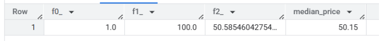
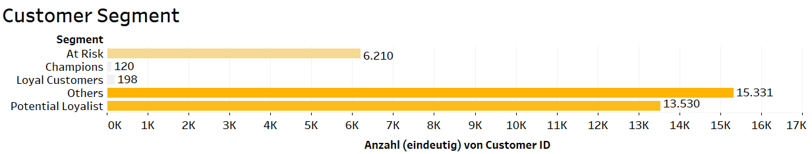
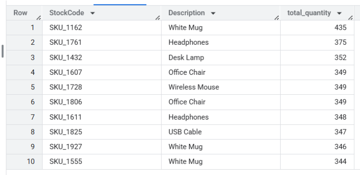
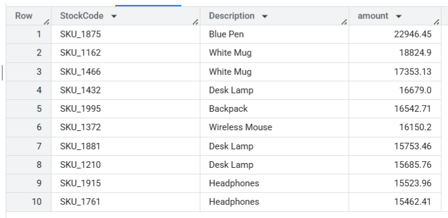
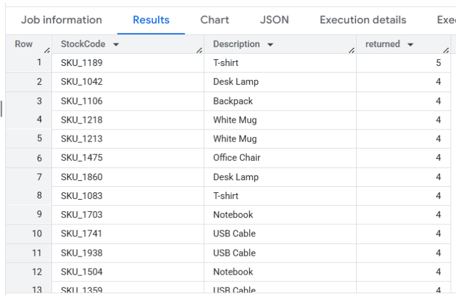
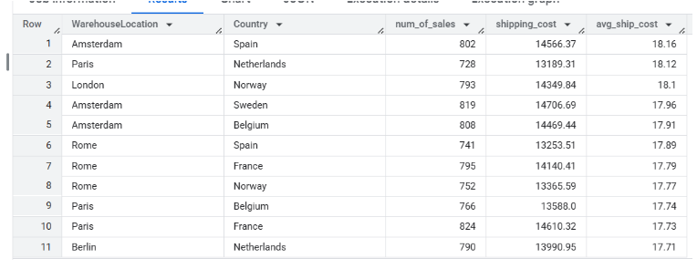
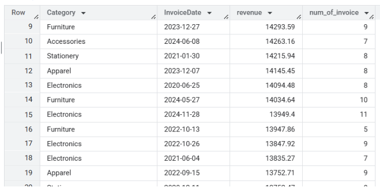

# Überblick
Dieses Projekt analysiert einen E-Commerce-Datensatz, um wichtige Verkaufstrends und Muster im Kundenverhalten zu identifizieren. Mithilfe von SQL und Tableau habe ich eine Datenbereinigung, KPI-Analyse und eine RFM-basierte Kundensegmentierung durchgeführt, um Marketingstrategien zu unterstützen und die Kundenbindung zu verbessern.

# Projektziele
Die Hauptziele dieses Projekts sind:

Das Kaufverhalten der Kunden verstehen und wertvolle Kundensegmente identifizieren

Umsetzbare Erkenntnisse für Marketing- und Vertriebsteams zur Verbesserung der Kundenbindung liefern

Die allgemeine Verkaufsleistung analysieren und ungewöhnliche Muster oder Datenqualitätsprobleme erkennen

Ein dynamisches Dashboard erstellen, um wichtige Kennzahlen zu visualisieren und datengestützte Entscheidungen zu unterstützen

Starke Fähigkeiten in der Datenanalyse demonstrieren, einschließlich SQL-Abfragen, Datenbereinigung, Segmentierungstechniken und Dashboard-Design

# Datensatz
Diese Analyse basiert auf einem Datensatz von Kaggle:
https://www.kaggle.com/datasets/yusufdelikkaya/online-sales-dataset

# Struktur des Repositories
images/ – Ein Verzeichnis, das Bilddateien enthält

bad_records.csv – Eine CSV-Datei mit Datensätzen, die während der Datenverarbeitung als ungültig oder fehlerhaft markiert wurden

online_sales_cleaned.csv – Eine bereinigte Version des Online-Verkaufsdatensatzes, bereit zur Analyse nach der Vorverarbeitung

online_sales_dataset.csv – Der Rohdatensatz der Online-Verkäufe, einschließlich aller Transaktionsdaten vor der Bereinigung

rfm_scores.csv – Eine CSV-Datei mit berechneten RFM-Werten (Recency, Frequency, Monetary) zur Kundensegmentierung

# Verwendete Tools
SQL: Datenbereinigung und erste Analyse, Datenmanipulation (BigQuery)

Tableau: Interaktive Dashboards und Datenvisualisierung

GitHub: Projekt-Hosting

# Analyse Schritt für Schritt
## Datenbereinigung
Der ursprüngliche Datensatz enthielt 49.782 Zeilen.

1. Überprüfung der Datentypen
Ich begann mit der Überprüfung der Datentypen jeder Spalte, um Konsistenz für die weitere Analyse sicherzustellen. Alle Datentypen waren angemessen, daher waren keine Änderungen erforderlich.

2. Analyse der Rechnungsnummer (InvoiceNo)
Ich überprüfte die Spalte InvoiceNo auf fehlende und doppelte Werte:

Fehlende Werte: Keine

SELECT InvoiceNo FROM Online_Retail.online_sales_dataset WHERE InvoiceNo IS NULL

Duplikate: 1.260 doppelte Rechnungsnummern

SELECT InvoiceNo, COUNT(*) AS cnt FROM Online_Retail.online_sales_dataset GROUP BY InvoiceNo HAVING COUNT(*) > 1

Eine genauere Untersuchung ergab, dass diese doppelten Rechnungsnummern keine exakten Duplikate darstellen. Die entsprechenden Zeilen unterscheiden sich in Produktdetails, Zeitstempeln und anderen relevanten Feldern:

SELECT * FROM Online_Retail.online_sales_dataset WHERE InvoiceNo IN ( SELECT InvoiceNo FROM Online_Retail.online_sales_dataset GROUP BY InvoiceNo HAVING COUNT(*) > 1 )

Entscheidung: Beibehalten der Duplikate, weil:

 - Sie enthalten unterschiedliche und wertvolle Transaktionsdetails (Produkt, Preis, Zeit usw.).

 - Sie machen nur 5 % des Datensatzes aus (2.548 Zeilen) und beeinflussen die Analyse nicht wesentlich.

3. Fehlende Werte und negative Mengen
Ich identifizierte fehlende Werte in folgenden Spalten:

CustomerID: 4.978 fehlende Werte

ShippingCost: 2.489 fehlende Werte

WarehouseLocation: 3.485 fehlende Werte

Ich analysierte anschließend Zeilen, in denen alle drei Felder gleichzeitig fehlten, und fand 2.489 solcher Zeilen. Zusätzlich hatten alle diese Zeilen negative Werte in der Spalte Quantity, was logisch ungültig ist:

SELECT * FROM Online_Retail.online_sales_dataset WHERE ShippingCost IS NULL AND CustomerID IS NULL AND WarehouseLocation IS NULL AND Quantity < 1

Diese Zeilen gelten als ungültig und unzuverlässig für die Analyse.

Vor dem Löschen speicherte ich diese Datensätze in einer Sicherungstabelle:

CREATE TABLE Online_Retail.bad_records AS SELECT * FROM Online_Retail.online_sales_dataset WHERE CustomerID IS NULL AND ShippingCost IS NULL AND WarehouseLocation IS NULL AND Quantity < 0;

Dann wurden sie aus dem Hauptdatensatz entfernt:

DELETE FROM Online_Retail.online_sales_dataset WHERE CustomerID IS NULL AND ShippingCost IS NULL AND WarehouseLocation IS NULL AND Quantity < 0;

4. Endgültiger Datensatz
Nach der Bereinigung enthält der Datensatz nun 47.293 Zeilen. Ich speicherte diese bereinigte Version unter dem Namen 'sales' zur Vereinfachung.

Verbleibende fehlende Werte:

CustomerID: 2.489 (5,2 %)

WarehouseLocation: 996 (2 %)

Diese fehlenden Werte wurden beibehalten, da sie die Analyse nicht wesentlich beeinträchtigen.

5. Ausreißer-Erkennung
InvoiceDate
Der Datumsbereich reicht vom 1. Januar 2020 bis zum 5. September 2025 – keine Auffälligkeiten gefunden.

SELECT MIN(InvoiceDate), MAX(InvoiceDate) FROM Online_Retail.sales

UnitPrice
Die Preiswerte wurden auf Minimum, Maximum, Mittelwert und Median analysiert:

SELECT MIN(UnitPrice), MAX(UnitPrice), AVG(UnitPrice), APPROX_QUANTILES(UnitPrice, 2)[OFFSET(1)] AS median_price FROM Online_Retail.sales UnitPriceStat

Die Ergebnisse waren konsistent – keine extremen Ausreißer.

Discount und ShippingCost
Beide Spalten lagen ebenfalls im plausiblen Bereich, daher war keine zusätzliche Bereinigung erforderlich.

6. Konsistenz bei Zeichenketten
Zur Standardisierung der kategorialen Werte überprüfte ich String-Spalten, insbesondere die Spalte Country:

SELECT DISTINCT Country FROM Online_Retail.sales
Keine Anomalien wie uneinheitliche Bezeichnungen (z. B. „United Kingdom“ vs. „U.K.“) wurden festgestellt.

### Fazit: Der Datensatz ist nun sauber, zuverlässig und bereit für die Analyse.

# Datenanalyse
## A. Umsatzübersicht
Gesamtumsatz:

SELECT ROUND(SUM(Quantity * UnitPrice * (1 - Discount)), 2) AS total_revenue FROM Online_Retail.sales

Umsatz nach Land:

SELECT Country, ROUND(SUM(Quantity * UnitPrice * (1 - Discount)), 2) AS revenue_by_country FROM Online_Retail.sales GROUP BY Country ORDER BY revenue_by_country DESC

Der Umsatz scheint über die Länder hinweg relativ gleichmäßig verteilt zu sein.

Umsatz nach Produktkategorie:

SELECT Category, ROUND(SUM(Quantity * UnitPrice * (1 - Discount)), 2) AS revenue_by_category FROM Online_Retail.sales GROUP BY Category ORDER BY revenue_by_category DESC

Auch hier generiert jede Produktkategorie ungefähr gleich viel Umsatz.

Umsatz nach Vertriebskanal:

SELECT SalesChannel, ROUND(SUM(Quantity * UnitPrice * (1 - Discount)), 2) AS revenue_by_channel FROM Online_Retail.sales GROUP BY SalesChannel ORDER BY revenue_by_channel DESC

Sowohl Online- als auch Offline-Kanäle generieren ähnlich hohe Umsätze.

## B. Kundenanalyse
Anzahl eindeutiger Kunden: 35.389

SELECT COUNT(DISTINCT CustomerID) AS count_customers FROM Online_Retail.sales

Durchschnittlicher Bestellwert pro Kunde:

SELECT DISTINCT CustomerID AS customer, ROUND(SUM(Quantity * UnitPrice * (1 - Discount)) / COUNT(DISTINCT InvoiceNo), 2) AS average_check FROM Online_Retail.sales WHERE CustomerID IS NOT NULL GROUP BY CustomerID ORDER BY average_check DESC

Kein einzelner Kunde dominiert den Umsatz – keine starken Ausreißer festgestellt.

Durchschnittlicher Gesamt-Bestellwert: $966,78

SELECT ROUND(SUM(Quantity * UnitPrice * (1 - Discount)) / COUNT(DISTINCT InvoiceNo), 2) AS total_average_check FROM Online_Retail.sales WHERE CustomerID IS NOT NULL

## C. RFM-Analyse
Zur Segmentierung der Kunden nach Wert und Verhalten führte ich eine RFM-Analyse durch, basierend auf:

Recency – Tage seit dem letzten Kauf

Frequency – Anzahl der eindeutigen Käufe

Monetary – Gesamtausgaben

Dies ermöglicht:

Identifikation von umsatzstarken Kunden

Zielgerichtete Ansprache loyaler oder gefährdeter Segmente

Personalisierung von Marketingstrategien

Schritt 1: Berechnung der R-, F- und M-Metriken

SELECT CustomerID, DATE_DIFF(DATE('2025-09-05'), DATE(MAX(InvoiceDate)), DAY) AS Recency, COUNT(DISTINCT InvoiceNo) AS Frequency, ROUND(SUM(Quantity * UnitPrice * (1 - Discount)), 2) AS Monetary FROM Online_Retail.sales GROUP BY CustomerID

Schritt 2: Berechnung der Quartile für Recency (zur Bewertung)

SELECT MIN(Recency) AS min_r, MAX(Recency) AS max_r, AVG(Recency) AS avg_r, APPROX_QUANTILES(Recency, 4)[OFFSET(1)] AS q1_25, APPROX_QUANTILES(Recency, 4)[OFFSET(2)] AS median, APPROX_QUANTILES(Recency, 4)[OFFSET(3)] AS q3_75 FROM Online_Retail.rfm_scores

Schritt 3: Vergabe der RFM-Scores und Segmentierung der Kunden

CREATE OR REPLACE TABLE Online_Retail.rfm_scores AS 
SELECT CustomerID, Recency, Frequency, Monetary,

-- R Score
CASE
  WHEN Recency <= 429 THEN 5
  WHEN Recency <= 906 THEN 4
  WHEN Recency <= 1454 THEN 3
  WHEN Recency <= 2074 THEN 2
  ELSE 1
END AS R_score,

-- F Score
CASE
  WHEN Frequency >= 5 THEN 5
  WHEN Frequency = 4 THEN 4
  WHEN Frequency = 3 THEN 3
  WHEN Frequency = 2 THEN 2
  ELSE 1
END AS F_score,

-- M Score
CASE
  WHEN Monetary >= 1770 THEN 5
  WHEN Monetary >= 890 THEN 4
  WHEN Monetary >= 346 THEN 3
  WHEN Monetary >= 0.72 THEN 2
  ELSE 1
END AS M_score,

-- Final Segment
CASE
  WHEN R_score >= 4 AND F_score >= 4 AND M_score >= 4 THEN 'Champions'
  WHEN R_score >= 4 AND (F_score >= 3 OR M_score >= 3) THEN 'Potential Loyalist'
  WHEN R_score >= 3 AND F_score >= 3 AND M_score >= 3 THEN 'Loyal Customers'
  WHEN R_score = 2 AND (F_score >= 3 OR M_score >= 3) THEN 'At Risk'
  WHEN R_score = 1 THEN 'Lost'
  ELSE 'Others'
END AS Segment
FROM Online_Retail.rfm_scores
Diese Segmentierung ermöglicht gezielte Strategien für jede Gruppe (z. B. Champions halten, verlorene Kunden zurückgewinnen).

Nächster Schritt: Anzahl der Kunden pro Segment zählen und visualisieren.

## D. Produktleistung
Top 10 Produkte nach Verkaufsmenge:

SELECT StockCode, Description, SUM(Quantity) AS total_quantity FROM Online_Retail.sales WHERE Quantity > 0 GROUP BY StockCode, Description ORDER BY total_quantity DESC LIMIT 10

Top 10 Produkte nach Umsatz:

SELECT StockCode, Description, ROUND(SUM(Quantity * UnitPrice * (1 - Discount)), 2) AS amount FROM Online_Retail.sales WHERE Quantity > 0 GROUP BY StockCode, Description ORDER BY amount DESC LIMIT 10

Meist retournierte Produkte:

SELECT StockCode, Description, COUNT(ReturnStatus) AS returned FROM Online_Retail.sales WHERE ReturnStatus = 'Returned' GROUP BY StockCode, Description ORDER BY returned DESC LIMIT 20

## E. Vertriebskanäle & Versand
Umsatz nach Vertriebskanal:

SELECT SalesChannel, ROUND(SUM(Quantity * UnitPrice * (1 - Discount)), 2) AS revenue FROM Online_Retail.sales GROUP BY SalesChannel

Versandkosten vs. Umsatz nach Anbieter:

SELECT ShipmentProvider, ROUND(SUM(Quantity * UnitPrice * (1 - Discount)), 2) AS total_revenue, ROUND(SUM(ShippingCost), 2) AS total_shipping_cost FROM Online_Retail.sales GROUP BY ShipmentProvider ORDER BY total_shipping_cost DESC

Durchschnittliche Versandkosten nach Lager und Land:

SELECT DISTINCT WarehouseLocation, Country, COUNT(InvoiceNo) AS num_of_sales, ROUND(SUM(ShippingCost), 2) AS shipping_cost, ROUND(SUM(ShippingCost)/COUNT(InvoiceNo), 2) AS avg_ship_cost FROM Online_Retail.sales WHERE WarehouseLocation IS NOT NULL GROUP BY WarehouseLocation, Country ORDER BY avg_ship_cost DESC

## F. Zeitreihenanalyse & Produktkategorien-Trends
Umsatz und Anzahl der Bestellungen pro Tag und Produktkategorie:

SELECT Category, DATE(InvoiceDate) AS InvoiceDate, ROUND(SUM(Quantity * UnitPrice * (1 - Discount)), 2) AS revenue, COUNT(InvoiceNo) AS num_of_invoice FROM Online_Retail.sales GROUP BY Category, InvoiceDate ORDER BY revenue DESC

Nach Abschluss der Analyse stellte ich fest, dass die Daten relativ gleichmäßig über verschiedene Dimensionen verteilt sind – einschließlich Umsatz, Länder, Versanddienstleister, Zahlungsmethoden und anderen Kategorien. Auch wenn dies plausibel sein könnte, ist es wahrscheinlicher, dass es daran liegt, dass der Datensatz synthetisch (künstlich generiert) ist.

### Beobachtungen
Eine auffällige Inkonsistenz in den Daten: Obwohl sowohl Online- als auch In-Store-Vertriebskanäle vorhanden sind, fehlen Barzahlungsmethoden. Wäre dies ein realer Datensatz, würde ich die Aufnahme von Bargeldtransaktionen empfehlen, um eine genauere kanalbasierte Analyse zu ermöglichen.

№ Visualisierung
Ich habe Visualisierungen für die folgenden Kennzahlen erstellt:

Umsatz im Zeitverlauf

Durchschnittlicher Bestellwert

Rückgabequote (%)

Verkäufe nach Ländern

Verkäufe nach Produktkategorie

Versandkosten

sowie ein interaktives Dashboard mit dynamischen Filtern:

Vertriebskanal

Zahlungsmethode

Land

Produktkategorie

Versanddienstleister

🔗 [Dashboard ansehen](https://public.tableau.com/app/profile/olesia.zahudaieva/viz/Dashboard_17486010555690/Dashboard1)

# Fazit und geschäftliche Empfehlungen
Basierend auf der Analyse zeigt das Unternehmen einen stabilen Umsatz, jedoch Anzeichen sinkender Rentabilität aufgrund der Inflation. Es wurden mehrere Datenprobleme festgestellt, insbesondere im Zusammenhang mit Zahlungsmethoden. Die folgenden Empfehlungen zielen darauf ab, diese Lücken zu schließen und die Kundenbeziehungen zu stärken.

## Stabiler Umsatz, sinkende Rentabilität
Im 5-Jahres-Zeitraum des Datensatzes blieb der Umsatz stabil. Angesichts steigender Inflation, Löhne und Betriebskosten bedeutet ein stabiler Umsatz jedoch wahrscheinlich eine rückläufige Rentabilität.

## Fehlende oder unvollständige Zahlungsdaten
Der Datensatz umfasst sowohl Online- als auch Filialverkäufe, jedoch werden ausschließlich elektronische Zahlungsmethoden erfasst (Banküberweisung, Kreditkarte, PayPal). Es ist allgemein bekannt, dass viele Kunden im stationären Handel nach wie vor mit Bargeld bezahlen – insbesondere bei günstigen Artikeln wie Tassen oder Stiften.

Wenn das Fehlen von Bargelddaten auf unvollständige Berichterstattung zurückzuführen ist, wird empfohlen, die fehlenden Daten zu erheben und die Analyse zu wiederholen.

Falls in den Filialen keine Barzahlung angeboten wird, ist dies eine verpasste Chance. Es wird empfohlen, Barzahlung als Option einzuführen, um die Zugänglichkeit zu erhöhen und alle Käufertypen zu erfassen.

## Empfehlungen je Kundensegment (basierend auf RFM-Analyse)
Champions
Sehr aktive Kunden: kürzlich gekauft, häufig gekauft, hoher Umsatz.
→ Exklusive Angebote, persönliche Rabatte und Premium-/Empfehlungsprogramme anbieten.

Loyale Kunden
Regelmäßige Käufer mit moderatem Umsatz und etwas älterer Kaufhistorie.
→ Treueprogramme entwickeln, Produktempfehlungen auf Basis früherer Käufe anbieten und regelmäßige Kommunikation pflegen.

Potenzielle Loyale Kunden
Kürzlich gekauft, mit Anzeichen von Loyalität.
→ Wiederholungskäufe mit Sonderangeboten, E-Mail-Kampagnen und personalisierten Produktempfehlungen fördern.

Gefährdete Kunden
Früher aktiv, aber seit Längerem kein Kauf mehr.
→ Rückgewinnungskampagnen starten: "Kommen Sie zurück"-Rabatte, Umfragen zur Ermittlung der Gründe für das Abwandern.

Andere (inaktiv / verloren / geringwertig)
Wenig relevante oder inaktive Kunden.
→ Minimale Betreuung: gelegentliche automatisierte Erinnerungen oder Testkampagnen – oder aus der aktiven Zielgruppe entfernen.
